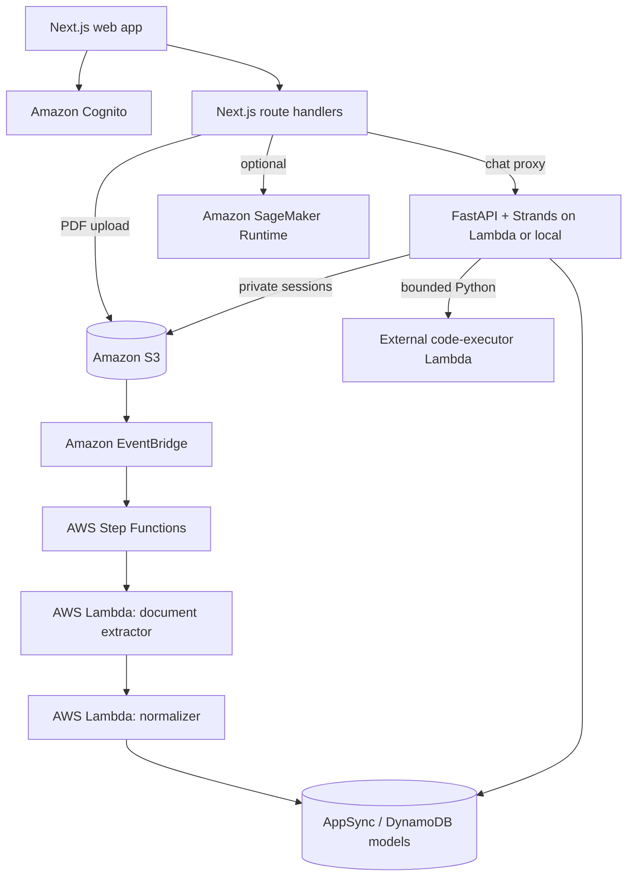

# FinFine Pro

FinFine Pro is a cash-flow intelligence workspace for Indian small and
medium-sized businesses. It turns financial PDFs and operational records into a
clear view of available cash, upcoming obligations, runway, forecasts, and
business actions.

## What problem does your project solve, and who is it for?

Small businesses often have the information needed to make a good financial
decision, but it is scattered across bank statements, invoices, purchase
records, spreadsheets, and tax reminders. Owners and operators spend too much
time reconciling documents and too little time understanding questions such as:

- Can I pay the next set of salaries, suppliers, and statutory obligations?
- Which payments are urgent, and which can be delayed safely?
- How much cash will remain after expected collections and expenses?
- Which products, suppliers, or inventory decisions are putting liquidity at
  risk?

FinFine Pro is built for Indian MSME owners, operators, accountants, and small
finance teams that need a practical financial control centre without a full-time
CFO. A user can upload baseline documents, confirm extracted fields, monitor
cash and obligations, explore forecasts, and ask a tenant-scoped assistant
questions about the business.

## How did you use AWS in your project? *(required)*

FinFine uses AWS as the secure system of record and as the serverless execution
layer for document ingestion, financial data access, forecasting integrations,
and the assistant runtime. The application keeps tenant identity tied to the
verified Amazon Cognito subject and routes document processing through an
asynchronous AWS workflow.

### Ship it: AWS services used

| AWS service / tool | How FinFine Pro uses it |
| --- | --- |
| **AWS Amplify Gen 2** | Defines and deploys the authentication, data, storage, and custom backend resources from TypeScript. It also generates `amplify_outputs.json` for the web client and server routes. |
| **AWS CDK** | Adds custom infrastructure that Amplify does not express directly: the ingestion EventBridge rule, Step Functions state machine, Docker-image Lambda, IAM grants, S3 lifecycle policy, and Function URL. |
| **Amazon Cognito** | Provides email-based sign-up/sign-in. Access tokens are verified by the Next.js server and again by the FastAPI agent runtime; the verified `sub` is the tenant boundary. |
| **AWS AppSync + Amazon DynamoDB** | Amplify Data models the canonical financial entities, including documents, transactions, obligations, products, sales, purchases, inventory, suppliers, onboarding, and forecasts. Server routes and agent tools read and write the deployed DynamoDB tables with tenant filters. |
| **Amazon S3** | Stores uploaded PDFs and private agent-session snapshots, transcripts, catalogs, and idempotency records. Browser uploads are mediated by authenticated server routes, and the bucket uses AES-256 server-side encryption. |
| **Amazon EventBridge** | Receives S3 `Object Created` events for canonical `tenants/` document keys and starts the ingestion workflow. |
| **AWS Step Functions** | Orchestrates the sequential extractor → normalizer pipeline with bounded timeouts and retries. |
| **AWS Lambda** | Runs the deterministic PDF extractor, ingestion normalizer, daily statutory-advisory job, and the Dockerized FastAPI/Strands agent backend. A separate `finfine-code-executor` Lambda is an external prerequisite for bounded Python analysis. |
| **Amazon SageMaker Runtime** | Optional forecasting integration: when `SAGEMAKER_ENDPOINT_NAME` is configured, the server forecast client can invoke a SageMaker endpoint; otherwise the application uses its embedded quantile forecast. |
| **IAM** | Limits Lambda access to the required DynamoDB tables, the private `agent-sessions/` S3 prefix, the ingestion bucket, and the external code-executor function. |

### AWS data flow

1. An authenticated user uploads a PDF through the Next.js API.
2. The API creates a pending `DocumentRecord` and writes the file to the
   tenant-scoped S3 key `tenants/{sub}/documents/{documentId}/...`.
3. S3 emits an object-created event to EventBridge.
4. Step Functions invokes the document-extractor Lambda and then the
   ingestion-normalizer Lambda.
5. The normalizer validates the extraction and writes canonical records to
   DynamoDB.
6. The dashboard and the read-only agent query tenant-scoped financial data;
   agent sessions are persisted under the private `agent-sessions/` prefix.

## Product highlights

- **Document ingestion:** Upload bank activity, sales, inventory, purchases,
  supplier, obligation, and recurring-expense PDFs through one canonical
  asynchronous pipeline.
- **Cash control:** See liquid cash, spendable cash, burn rate, commitments,
  runway, and statutory lockbox totals.
- **Obligation prioritization:** Surface upcoming payables and receivables with
  deterministic category weights and reviewable source records.
- **Forecasting:** Generate P10/P50/P90 cash trajectories with obligations,
  minimum cash buffers, seasonality, and optional stress scenarios.
- **Business intelligence:** Explore products, sales, inventory, suppliers,
  purchases, and recurring expenses through the dashboard and assistant.
- **Tenant-scoped assistant:** Ask questions in natural language, export bounded
  CSV artifacts, and run bounded financial Python analysis without allowing the
  model to write canonical financial records.
- **Accessible by design:** The interface supports English, Hindi, Tamil, and
  Malayalam, with responsive dashboard, onboarding, and document-review flows.

## Architecture



The active extractor is deterministic and local (`unpdf`). It handles
text-bearing PDFs and reports scanned/image-only PDFs as requiring review; the
current ingestion path does not perform OCR or invoke a remote vision model.

## Tech stack

- **Web:** Next.js App Router, React, TypeScript, Tailwind CSS, Recharts, and
  AWS Amplify client libraries.
- **Backend infrastructure:** AWS Amplify Gen 2, AWS CDK, Amazon Cognito,
  AppSync, DynamoDB, S3, EventBridge, Step Functions, and Lambda.
- **Agent:** Python 3.11–3.13, FastAPI, Uvicorn, Strands, PyJWT, and boto3.
- **Document processing:** TypeScript Lambda functions and `unpdf` for local
  text extraction, followed by validation and normalization.
- **Forecasting:** TypeScript embedded quantile forecasting, optional SageMaker
  Runtime invocation, and a Python agent-side scenario tool.

## Repository layout

```text
finfine-pro/
├── amplify/                 # Amplify resources and custom CDK infrastructure
├── agent_backend/            # FastAPI/Strands runtime and Python tests
├── src/                      # Next.js pages, APIs, stores, and components
├── scripts/                  # Sample data, procurement, and deployment helpers
├── skills/                   # Agent analysis guides
├── tests/                    # Node-based proxy and ingestion tests
└── docs/                     # Architecture, schema, ingestion, agent, and UI docs
```

## Quick start

### Prerequisites

- Node.js `>= 20.9.0` and npm
- Python `>= 3.11,<3.14` and [uv](https://docs.astral.sh/uv/)
- AWS CLI configured for an account where you can create the sandbox resources
- Docker Desktop when deploying the Docker-image Lambda through Amplify/CDK
- An LLM provider key for the local agent, such as OpenRouter or Groq

Verify AWS access before creating resources:

```bash
aws sts get-caller-identity
```

### Install dependencies

```bash
npm install

cd agent_backend
uv sync
cp env.example .env
cd ..
```

Edit `agent_backend/.env` with your own model key and the Cognito, S3, and
table values for the environment where the local agent will run. Never commit
that file or any other secret-bearing `.env` file.

### Create the Amplify sandbox

The web client imports the generated `amplify_outputs.json`; each developer
should generate their own copy rather than committing one from another
environment.

```bash
# One deployment pass
npx ampx sandbox --once

# Or keep the sandbox running and watch backend changes
npx ampx sandbox
```

The sandbox provisions Cognito, the Amplify Data/AppSync and DynamoDB models,
the S3 bucket, ingestion Lambdas, EventBridge rule, Step Functions state
machine, statutory schedule, and the Docker-image agent Lambda. The generated
agent URL is added to the custom Amplify outputs.

### Run the web app

```bash
npm run dev
```

Open [http://localhost:3000](http://localhost:3000), create an account, complete
onboarding, and upload a supported PDF from the Documents area.

### Run the agent locally (optional)

The default sandbox configuration points the web app at the deployed Lambda
Function URL. To run the FastAPI agent on your machine instead, create an
ignored root `.env.local` with:

```text
FINFINE_AGENT_RUNTIME_URL=http://127.0.0.1:8080
```

Fill the table names, Cognito identifiers, session bucket, and model settings
in `agent_backend/.env` using the generated `amplify_outputs.json`, then start
the service in a second terminal:

```bash
cd agent_backend
uv run uvicorn finfine_agent.api:app --reload --host 127.0.0.1 --port 8080
```

The local service exposes `GET /ping`, buffered and streaming invocation
endpoints, and authenticated conversation-history endpoints. The detailed
request/response contract is in
[docs/AGENT_BACKEND.md](docs/AGENT_BACKEND.md).

## Use the ingestion pipeline

The supported integration is an authenticated multipart upload:

```bash
curl -X POST http://localhost:3000/api/ingestion/upload \
  -H "Authorization: Bearer <cognito-access-token>" \
  -F "file=@sample_data/example.pdf;type=application/pdf" \
  -F "purpose=ONBOARDING_BASELINE" \
  -F "category=BANK_ACTIVITY"
```

The API returns `202 Accepted` after writing the pending manifest and PDF. The
AWS workflow completes extraction and normalization asynchronously. Supported
categories and validation rules are documented in
[docs/INGESTION_INTEGRATION.md](docs/INGESTION_INTEGRATION.md).

Generate local sample PDFs with:

```bash
npx tsx scripts/generate-sample-data.ts
npx tsx scripts/generate-6month-statement.ts
npx tsx scripts/generate-sample-statement.ts
```

Generated files are placed in `sample_data/`, which is ignored by Git. Use the
Documents page or the authenticated upload contract above to ingest them.

## Tests and useful commands

```bash
# Next.js production build
npm run build

# ESLint
npm run lint

# Chat proxy tests
npm run test:proxy

# Deterministic extractor/normalizer tests
node --import tsx --test tests/ingestion-pipeline.test.ts

# Agent backend tests
cd agent_backend
uv run pytest -q
```

For tax and market-calendar development data, use `npm run procure:taxes` only
against an explicitly configured development environment.

## Deployment notes

`amplify/backend.ts` is the infrastructure entry point. It creates the
Amplify-managed resources plus two custom stacks:

- `IngestionPipelineStack` for S3 notifications, EventBridge, and Step
  Functions.
- `AgentBackendStack` for the x86_64 Docker-image Lambda and its Function URL.

The agent Function URL is intentionally configured with transport-level
`NONE` authentication; the Next.js chat proxy and FastAPI runtime enforce
Cognito access-token validation at the application layer. The external
`finfine-code-executor` Lambda is not provisioned by this repository and must
be supplied separately if Python tool execution is enabled.

The checked-in backend does not provision API Gateway, App Runner, or a Next.js
hosting service. The frontend can be run locally or deployed through a separate
hosting workflow. Review [docs/AWS_ARCHITECTURE.md](docs/AWS_ARCHITECTURE.md)
before promoting a sandbox configuration.

To remove a sandbox after development:

```bash
npx ampx sandbox delete
```

## Documentation

- [Architecture](docs/ARCHITECTURE.md)
- [AWS architecture](docs/AWS_ARCHITECTURE.md)
- [Agent backend](docs/AGENT_BACKEND.md)
- [Ingestion integration](docs/INGESTION_INTEGRATION.md)
- [Data schema and storage](docs/DATA_SCHEMA_AND_STORAGE.md)
- [Design system](docs/DESIGN_SYSTEM.md)

## Security and implementation boundaries

- Do not commit API keys, Cognito tokens, generated Amplify outputs, or local
  `.env` files.
- Tenant identity comes from the verified Cognito access-token `sub`; canonical
  upload and chat paths do not accept a caller-selected tenant ID.
- Browser clients do not receive direct S3 object permissions; uploads go
  through the authenticated server route.
- The assistant is read-only with respect to canonical financial records.
- Text extraction is deterministic and local today. Scanned PDFs need a
  text-bearing export or a future OCR integration.
