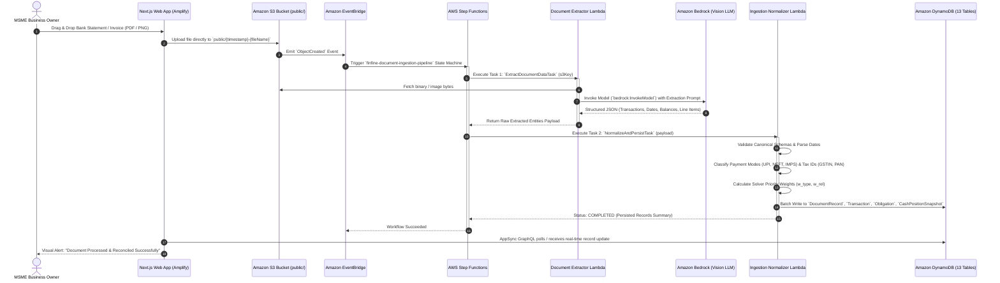
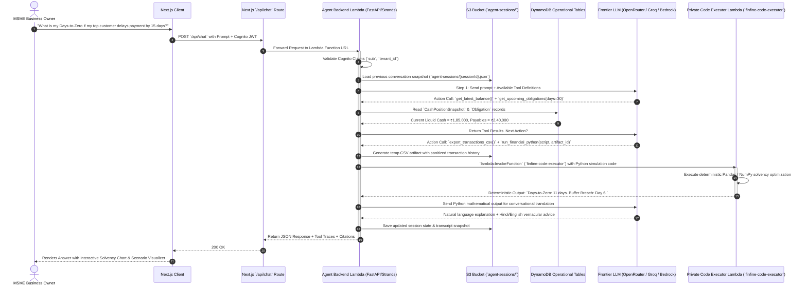
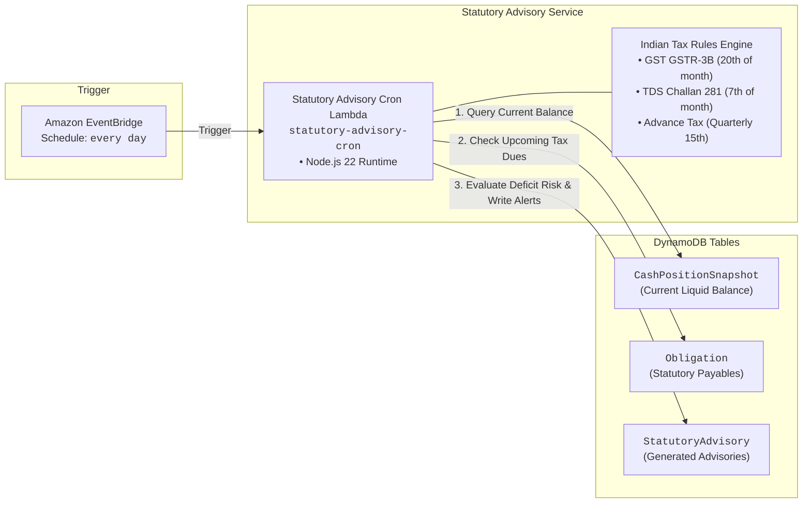
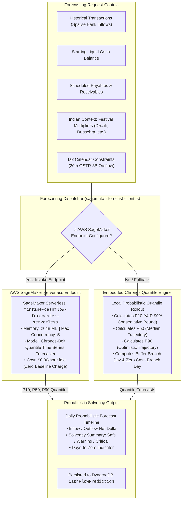

# FinFine Pro — Implemented AWS Architecture Audit & System Topology

**AWS Region:** `ap-south-1` (Mumbai)  
**Deployment Framework:** AWS Amplify Gen 2 (TypeScript Code-First CDK) + Custom AWS CDK Stacks + AWS SageMaker Serverless  
**Tenant Model:** Single-tenant logical isolation with server-side `FINFINE_TENANT_ID` enforcement (`msme-001`)  
**Evaluation Budget Target:** < $100 (100% Serverless, Scale-to-Zero Compute)

---

## 1. Master System Architecture Topology

The following comprehensive diagram illustrates the complete, implemented AWS infrastructure of FinFine Pro. It captures the ingress paths, event-driven pipelines, serverless compute containers, synchronous decision engine, private execution sandbox, AppSync GraphQL data layer, and ML inference endpoints.

```mermaid
graph TB
    %% ==========================================
    %% CLIENT & CDN LAYER
    %% ==========================================
    subgraph CLIENT_LAYER["1. Client & Presentation Layer (Edge / Web)"]
        User["MSME Business Owner<br/>(Mobile / Desktop Browser)"]
        NextApp["AWS Amplify Hosting / Next.js 15 App<br/>• Financial Dashboard & KPI Metrics<br/>• Conversational Agent Interface<br/>• Document Ingestion Hub<br/>• Indian Tax & Festival Engine"]
        User -->|HTTPS / WSS| NextApp
    end

    %% ==========================================
    %% IDENTITY & SECURITY LAYER
    %% ==========================================
    subgraph AUTH_LAYER["2. Identity & Access Management (Amazon Cognito)"]
        CognitoUP["Cognito User Pool<br/><code>ap-south-1_KVmzMiOuV</code><br/>• Email/Password Auth<br/>• Tenant Scoped JWTs"]
        CognitoClient["User Pool Client<br/><code>tobqdohiogtle50s6fsp2h66d</code>"]
        CognitoIDP["Cognito Identity Pool<br/><code>ap-south-1:d0c9403d-f81b-4781-9910-37f5cfe2dc2f</code><br/>• Guest & Auth IAM Roles"]
        CognitoUP --- CognitoClient
        CognitoClient --- CognitoIDP
        NextApp -->|1. Authenticate & Obtain JWT| CognitoUP
        NextApp -->|2. STS Credentials for S3 / AppSync| CognitoIDP
    end

    %% ==========================================
    %% STORAGE LAYER
    %% ==========================================
    subgraph S3_STORAGE["3. Object Storage Layer (Amazon S3)"]
        S3Bucket["Amazon S3 Document & Session Bucket<br/><code>amplify-finfinepro-vicfic-finfinedocumentstoragebu-nm3ks1cueqmt</code><br/>• AES256 Server-Side Encryption<br/>• EventBridge Notifications Enabled"]
        
        subgraph S3_PREFIXES["S3 Prefix Architecture"]
            S3Uploads["<code>public/</code> & <code>uploads/</code><br/>• Raw PDF Bank Statements<br/>• Invoice & Bill PNG / JPG Images<br/>• POS Slips & GST Challans<br/>(Client Direct Upload via Amplify)"]
            S3Sessions["<code>agent-sessions/</code><br/>• Durable Chat Snapshots<br/>• CSV Financial Artifacts<br/>• 30-Day Auto-Expiry Lifecycle Rule<br/>(Server-Side Only Access)"]
        end
        S3Bucket --- S3Uploads
        S3Bucket --- S3Sessions
        NextApp -->|Presigned Direct Upload| S3Uploads
    end

    %% ==========================================
    %% ASYNCHRONOUS INGESTION PIPELINE
    %% ==========================================
    subgraph INGESTION_PIPELINE["4. Asynchronous Ingestion & Extraction Pipeline"]
        EventBridge["Amazon EventBridge<br/>Rule: <code>finfine-s3-document-created-rule</code><br/>Event Pattern: ObjectCreated on <code>public/*</code>, <code>tenants/*</code>, <code>uploads/*</code>"]
        
        subgraph STEP_FUNCTIONS["AWS Step Functions Workflow"]
            SFNStateMachine["State Machine: <code>finfine-document-ingestion-pipeline</code><br/>Timeout: 5 min | Error Backoff & Retry"]
            
            SFNTask1["Task 1: <code>ExtractDocumentDataTask</code><br/>• Invokes Document Extractor Lambda<br/>• Timeout: 120s | 3x Exponential Retries"]
            SFNTask2["Task 2: <code>NormalizeAndPersistTask</code><br/>• Invokes Ingestion Normalizer Lambda<br/>• Timeout: 60s | 2x Retries"]
            
            SFNStateMachine --> SFNTask1
            SFNTask1 -->|Raw JSON Payload| SFNTask2
        end

        DocExtractorLambda["Document Extractor Lambda<br/>(Node.js 22 / TypeScript)<br/>Memory: 1024 MB | Timeout: 120s"]
        BedrockLLM["Amazon Bedrock<br/>Multimodal Vision Models<br/>(Claude 3.5 Sonnet / Nemotron)<br/>• Extracts Tables, Dates, Balances, Parties"]
        
        NormalizerLambda["Ingestion Normalizer Lambda<br/>(Node.js 22 / TypeScript)<br/>• Schema Validation & Normalization<br/>• GSTIN / PAN / UPI Categorization<br/>• Multi-Table DynamoDB Batch Writer"]

        S3Uploads -->|ObjectCreated Notification| EventBridge
        EventBridge -->|Trigger Execution| SFNStateMachine
        SFNTask1 -.->|Invokes| DocExtractorLambda
        DocExtractorLambda -->|Read Document Object| S3Uploads
        DocExtractorLambda -->|Multimodal Extraction Prompt| BedrockLLM
        SFNTask2 -.->|Invokes| NormalizerLambda
    end

    %% ==========================================
    %% SYNCHRONOUS AGENT BACKEND & DECISION CORE
    %% ==========================================
    subgraph AGENT_CORE["5. Agent Decision Core & Execution Sandbox"]
        NextChatRoute["Next.js Chat Proxy API Route<br/><code>/api/chat</code><br/>• Auth Verification & Token Forwarding<br/>• Timeout Protection & CORS Gateway"]
        
        AgentLambda["FinFine Agent Backend (Docker Image Function)<br/><code>FinFineAgentBackendFunction</code><br/>• AWS Lambda Function URL (CORS Enabled)<br/>• FastAPI + Strands Agent Framework<br/>• Tool Orchestration (LLM: Groq / Bedrock / OpenRouter)<br/>• Memory: 1024 MB | Timeout: 180s"]
        
        CodeExecutorLambda["Private Code Executor Lambda<br/><code>finfine-code-executor</code><br/>• Sandboxed Python 3.12 Runtime<br/>• NumPy, Pandas, SciPy, Scikit-Learn<br/>• Zero LLM Hallucinations for Math/Runway"]

        NextApp -->|POST /api/chat| NextChatRoute
        NextChatRoute -->|HTTPS Buffered Invocation| AgentLambda
        AgentLambda -->|Durable Session Read / Write| S3Sessions
        AgentLambda -->|InvokeFunction RPC| CodeExecutorLambda
    end

    %% ==========================================
    %% OPERATIONAL DATA LAYER (APPSYNC & DYNAMODB)
    %% ==========================================
    subgraph DATA_LAYER["6. Operational Data Layer (AppSync GraphQL & DynamoDB)"]
        AppSyncAPI["AWS AppSync GraphQL API<br/><code>https://g63ka56mbrhl3lrpoolbcifssy.appsync-api.ap-south-1.amazonaws.com/graphql</code><br/>Auth: IAM & Cognito User Pools"]
        
        subgraph DYNAMODB_TABLES["Amazon DynamoDB Canonical Tables (13+ Models)"]
            T_Doc["<code>DocumentRecord</code><br/>Extraction status, metadata & S3 keys"]
            T_Txn["<code>Transaction</code><br/>Inflows, outflows, UPI/NEFT, categories"]
            T_Obl["<code>Obligation</code><br/>Payables, receivables, statutory tax dues"]
            T_Cash["<code>CashPositionSnapshot</code><br/>Daily closing balances & liquid cash"]
            T_Prod["<code>Product</code><br/>SKUs, items, UOM, aliases"]
            T_Sale["<code>Sale</code> & <code>SaleLineItem</code><br/>Revenues, customer orders, line items"]
            T_Pur["<code>Purchase</code> & <code>PurchaseLineItem</code><br/>Vendor bills, item costs, quantities"]
            T_Supp["<code>SupplierProfile</code> & <code>SupplierProductTerms</code><br/>Lead times, credit periods, pricing"]
            T_Set["<code>MerchantFinancialSettings</code><br/>Buffer thresholds, horizons, fallback flags"]
            T_Rec["<code>RecurringExpense</code><br/>Rent, salaries, monthly overhead schedules"]
            T_Adv["<code>StatutoryAdvisory</code><br/>Tax deadlines, GST/TDS payment advisories"]
            T_Pred["<code>CashFlowPrediction</code><br/>Historical probabilistic forecast logs"]
        end

        NextApp -->|Direct GraphQL Queries / Mutations| AppSyncAPI
        AppSyncAPI --> DYNAMODB_TABLES
        NormalizerLambda -->|Batch Put Records| DYNAMODB_TABLES
        AgentLambda -->|Direct Read Operations via Boto3| DYNAMODB_TABLES
    end

    %% ==========================================
    %% CRON & SCHEDULED INTELLIGENCE
    %% ==========================================
    subgraph CRON_SERVICE["7. Scheduled Tax & Statutory Advisory Engine"]
        DailyCronRule["EventBridge Cron Schedule<br/><code>rate(1 day)</code> / <code>every day</code>"]
        StatutoryCronLambda["Statutory Advisory Cron Lambda<br/><code>statutory-advisory-cron</code><br/>(Node.js 22 / TypeScript)<br/>Memory: 512 MB | Timeout: 60s"]

        DailyCronRule -->|Daily Trigger| StatutoryCronLambda
        StatutoryCronLambda -->|Read Obligations & Settings| T_Obl
        StatutoryCronLambda -->|Read Cash Position| T_Cash
        StatutoryCronLambda -->|Generate Warning Alerts| T_Adv
    end

    %% ==========================================
    %% FORECASTING & SAGEMAKER INFERENCE
    %% ==========================================
    subgraph FORECAST_ENGINE["8. Probabilistic Cash Flow Forecasting Engine"]
        ForecastClient["Next.js Forecasting Client<br/><code>sagemaker-forecast-client.ts</code><br/>• Indian Festive Multipliers (Diwali, etc.)<br/>• Statutory Drain Dates (20th GSTR-3B)<br/>• Weekend Banking Delays"]
        
        SageMakerServerless["AWS SageMaker Serverless Endpoint<br/><code>finfine-cashflow-forecaster-serverless</code><br/>• Chronos-Bolt Probabilistic Quantile Forecaster<br/>• 2048 MB Memory | Concurrency: 5<br/>• $0.00 / hr idle (Scale-to-Zero)"]
        
        EmbeddedChronos["Embedded Quantile Fallback Engine<br/>• Fast Local Quantile Simulation (P10, P50, P90)<br/>• Days-to-Zero & Buffer Breach Solvency"]

        NextApp --> ForecastClient
        ForecastClient -->|1. Try Boto3 / SDK Invoke| SageMakerServerless
        ForecastClient -->|2. Zero-Latency Fallback| EmbeddedChronos
        ForecastClient -.->|Persist Forecast Snapshots| T_Pred
    end

    %% Flow Styling
    classDef clientStyle fill:#1e293b,stroke:#3b82f6,stroke-width:2px,color:#f8fafc;
    classDef authStyle fill:#1e1b4b,stroke:#6366f1,stroke-width:2px,color:#f8fafc;
    classDef storageStyle fill:#14532d,stroke:#22c55e,stroke-width:2px,color:#f8fafc;
    classDef pipelineStyle fill:#451a03,stroke:#f97316,stroke-width:2px,color:#f8fafc;
    classDef agentStyle fill:#3b0764,stroke:#a855f7,stroke-width:2px,color:#f8fafc;
    classDef dataStyle fill:#0c4a6e,stroke:#0284c7,stroke-width:2px,color:#f8fafc;
    classDef cronStyle fill:#374151,stroke:#9ca3af,stroke-width:2px,color:#f8fafc;
    classDef mlStyle fill:#701a75,stroke:#ec4899,stroke-width:2px,color:#f8fafc;

    class User,NextApp clientStyle;
    class CognitoUP,CognitoClient,CognitoIDP authStyle;
    class S3Bucket,S3Uploads,S3Sessions storageStyle;
    class EventBridge,SFNStateMachine,SFNTask1,SFNTask2,DocExtractorLambda,BedrockLLM,NormalizerLambda pipelineStyle;
    class NextChatRoute,AgentLambda,CodeExecutorLambda agentStyle;
    class AppSyncAPI,T_Doc,T_Txn,T_Obl,T_Cash,T_Prod,T_Sale,T_Pur,T_Supp,T_Set,T_Rec,T_Adv,T_Pred dataStyle;
    class DailyCronRule,StatutoryCronLambda cronStyle;
    class ForecastClient,SageMakerServerless,EmbeddedChronos mlStyle;
```

---

## 2. In-Depth Subsystem Architectural Breakdowns

### Subsystem 1: Event-Driven Document Ingestion & Multimodal Extraction Pipeline

When an MSME owner uploads a bank statement PDF, invoice image, or GST receipt, the entire processing flow executes asynchronously without blocking the UI.

---

### Subsystem 2: Synchronous Agentic Decision Core & Code Sandbox

The conversational AI system follows a zero-hallucination paradigm where natural language reasoning is handled by an LLM, but **all financial arithmetic, linear programming, aggregation, and runway modeling are offloaded to a private Python Lambda sandbox**.

---

### Subsystem 3: Daily Statutory Advisory & Tax Drain Cron Engine

To prevent catastrophic GST and TDS defaults, a serverless daily cron continuously correlates impending statutory deadlines against live cash balances.

---

### Subsystem 4: AWS SageMaker Serverless Probabilistic Forecasting

---

## 3. Implemented AWS Resource Inventory & Configuration Matrix

| Category | AWS Resource Name / Identifier | ARN / Physical Identifier | Purpose / Sizing / Timeout |
| :--- | :--- | :--- | :--- |
| **Auth** | Amazon Cognito User Pool | `ap-south-1_KVmzMiOuV` | MSME owner authentication, tenant isolation claims |
| **Auth** | Amazon Cognito App Client | `tobqdohiogtle50s6fsp2h66d` | Secure client-side authentication without secret leak |
| **Auth** | Amazon Cognito Identity Pool | `ap-south-1:d0c9403d-f81b-4781-9910-37f5cfe2dc2f` | Direct IAM credential vending for S3 & AppSync |
| **Storage** | Amazon S3 Document Bucket | `amplify-finfinepro-vicfic-finfinedocumentstoragebu-nm3ks1cueqmt` | Raw statement storage (`public/`), Durable sessions (`agent-sessions/`), 30-day lifecycle expiration |
| **Eventing** | Amazon EventBridge Rule | `finfine-s3-document-created-rule` | Captures S3 `ObjectCreated` events on document prefixes |
| **Orchestration** | AWS Step Functions State Machine | `arn:aws:states:ap-south-1:359851121709:stateMachine:finfine-document-ingestion-pipeline` | Asynchronous 2-step extraction & normalization pipeline (Timeout: 5m) |
| **Compute (Lambda)** | Document Extractor Lambda | `arn:aws:lambda:ap-south-1:359851121709:function:amplify-finfinepro-vicfic-documentextractorlambda4-8qlwJ9kgd9lH` | Multimodal parsing with Bedrock Claude/Nemotron (Timeout: 120s, 1024 MB) |
| **Compute (Lambda)** | Ingestion Normalizer Lambda | `arn:aws:lambda:ap-south-1:359851121709:function:amplify-finfinepro-vicfic-ingestionnormalizerlambd-eSvpfyEK6P77` | Canonical schema validation & batch DynamoDB persist (Timeout: 60s, 512 MB) |
| **Compute (Lambda)** | FinFine Agent Backend Function | `arn:aws:lambda:ap-south-1:359851121709:function:amplify-finfinepro-vicfic-FinFineAgentBackendFunct-3ihGWF36OvcV` | Docker-based FastAPI/Strands agent (Timeout: 180s, 1024 MB) |
| **Compute (URL)** | Agent Lambda Function URL | `https://kmhpckylfd6wzgiy4s2tgyfcdq0cnxbd.lambda-url.ap-south-1.on.aws/` | Direct HTTPS entrypoint with full CORS support |
| **Compute (Lambda)** | Code Executor Sandbox | `arn:aws:lambda:ap-south-1:359851121709:function:finfine-code-executor` | Private Python 3.12 sandbox (NumPy, pandas, SciPy, PuLP) |
| **Compute (Lambda)** | Statutory Advisory Cron Lambda | `arn:aws:lambda:ap-south-1:359851121709:function:amplify-finfinepro-vicfic-statutoryadvisorycronlam-HczzGemyv5Wf` | Daily tax deadline & cash drain evaluator (Timeout: 60s, 512 MB) |
| **API** | AWS AppSync GraphQL Endpoint | `https://g63ka56mbrhl3lrpoolbcifssy.appsync-api.ap-south-1.amazonaws.com/graphql` | Managed GraphQL query/mutation layer with Cognito & IAM auth |
| **Database** | DynamoDB: `DocumentRecord` | `DocumentRecord-ifsueqzwybf6nau7duulv5qweq-NONE` | Document upload metadata, S3 keys, processing statuses |
| **Database** | DynamoDB: `Transaction` | `Transaction-ifsueqzwybf6nau7duulv5qweq-NONE` | Inflows, outflows, bank balance history, UPI identifiers |
| **Database** | DynamoDB: `Obligation` | `Obligation-ifsueqzwybf6nau7duulv5qweq-NONE` | Payables, receivables, statutory tax dues, priority weights |
| **Database** | DynamoDB: `CashPositionSnapshot` | `CashPositionSnapshot-ifsueqzwybf6nau7duulv5qweq-NONE` | Daily liquid cash balances and bank reconciliations |
| **Database** | DynamoDB: `Product` | `Product-ifsueqzwybf6nau7duulv5qweq-NONE` | Inventory product catalog, SKUs, aliases |
| **Database** | DynamoDB: `Sale` & `SaleLineItem` | `Sale-ifsueqzwybf6nau7duulv5qweq-NONE`, etc. | Sales transactions and itemized line items |
| **Database** | DynamoDB: `Purchase` & `PurchaseLineItem` | `Purchase-ifsueqzwybf6nau7duulv5qweq-NONE`, etc. | Supplier purchase bills and itemized costs |
| **Database** | DynamoDB: `SupplierProfile` & `Terms` | `SupplierProfile-ifsueqzwybf6nau7duulv5qweq-NONE`, etc. | Supplier credit days, lead times, reliability scores |
| **Database** | DynamoDB: `MerchantFinancialSettings` | `MerchantFinancialSettings-ifsueqzwybf6nau7duulv5qweq-NONE` | Minimum buffer rules (₹), forecast horizon defaults |
| **Database** | DynamoDB: `RecurringExpense` | `RecurringExpense-ifsueqzwybf6nau7duulv5qweq-NONE` | Recurring rent, payroll, utility expense schedules |
| **Database** | DynamoDB: `StatutoryAdvisory` | `StatutoryAdvisory-ifsueqzwybf6nau7duulv5qweq-NONE` | Daily tax deadline warnings & compliance advisories |
| **Database** | DynamoDB: `CashFlowPrediction` | `CashFlowPrediction` | Historical probabilistic forecast records & summaries |
| **ML / AI** | Amazon Bedrock Models | `anthropic.claude-3-5-sonnet` / `nvidia.nemotron-nano-12b` | Multimodal document parsing & OCR extraction |
| **ML / AI** | AWS SageMaker Serverless Endpoint | `finfine-cashflow-forecaster-serverless` | Serverless Chronos-Bolt probabilistic forecasting (2048 MB) |

---

## 4. Security, Multi-Tenancy & Network Isolation Model

1. **Authentication Boundary:**
   - User identity authenticated via Cognito User Pool issuing signed JWTs.
   - Every API request is verified against the `sub` claim.
   - `FINFINE_TENANT_ID` is strictly bound on the server side (`msme-001`), preventing tenant data cross-contamination.

2. **Storage Access Segregation:**
   - Client applications only possess scoped IAM permissions to write to `public/*` in Amazon S3 for document ingestion.
   - `agent-sessions/*` is strictly non-routable from client browsers; only the Agent Backend IAM execution role possesses `s3:GetObject`, `s3:PutObject`, and `s3:DeleteObject` permissions for chat snapshots.
   - S3 bucket enforces default `AES256` server-side encryption.

3. **Execution Sandbox Isolation:**
   - Arbitrary financial Python calculations never execute inside the web server or container runtime directly.
   - Calculations are serialized into code payload and dispatched to `finfine-code-executor` Lambda, which runs in an isolated sandbox with zero access to persistent storage or unvended AWS APIs.

4. **Zero Continuous Baseline Cost ($100 Envelope Compliance):**
   - No provisioned EC2 instances, ECS clusters, or OpenSearch domains.
   - AppSync, DynamoDB, Lambda, Step Functions, S3, and SageMaker Serverless all scale to absolute zero ($0.00/hr) during idle periods.
