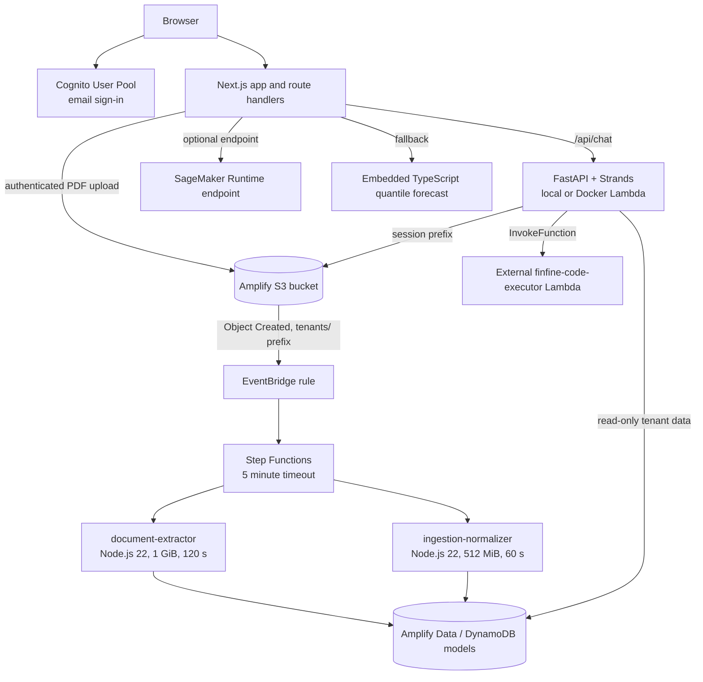

# FinFine Pro — implemented AWS architecture

This document audits the AWS resources represented by the checked-in Amplify
Gen 2/CDK code. It is not an inventory of a particular deployed sandbox. Names,
ARNs, table suffixes, and endpoints vary by deployment and should be read from
`amplify_outputs.json` or the AWS console.

## Infrastructure source of truth

`amplify/backend.ts` calls `defineBackend()` and then adds two custom CDK
stacks:

- `IngestionPipelineStack` contains the S3 event rule and Step Functions
  workflow.
- `AgentBackendStack` contains the Docker-image Lambda and its Function URL.

The default region used by application code and examples is `ap-south-1`, but
the region is ultimately selected by the Amplify deployment environment.

## Resource topology



## Amplify-managed resources

### Identity

`amplify/auth/resource.ts` defines a Cognito User Pool with email sign-in.
The browser uses the generated outputs through `Amplify.configure()`. Server
routes verify Cognito access tokens with `aws-jwt-verify`; the FastAPI runtime
performs a second verification with PyJWT and the Cognito JWKS endpoint.

### Data

`amplify/data/resource.ts` defines 21 `a.model()` entities and sets the default
authorization mode to the Cognito user pool. Most models use:

```ts
allow.ownerDefinedIn('tenantId').identityClaim('sub')
```

`RecurringExpense` is the exception: its current rule allows both guest and
authenticated access. The models are generated as Amplify Data/AppSync-backed
DynamoDB resources. This repository does not declare a custom single-table key
layout or the GSIs described in earlier design notes.

The model list is:

`DocumentRecord`, `Transaction`, `Obligation`,
`MerchantFinancialSettings`, `CashPositionSnapshot`, `Product`, `Sale`,
`SaleLineItem`, `InventorySnapshot`, `InventoryItem`, `Purchase`,
`PurchaseLineItem`, `SupplierProfile`, `SupplierProductTerms`,
`PurchaseOrder`, `PurchaseOrderLineItem`, `RecurringExpense`,
`CashFlowPrediction`, `MerchantOnboarding`, `MerchantFieldConfirmation`, and
`ExpectedReceivable`.

### Storage

`amplify/storage/resource.ts` defines one bucket named
`finfineDocumentStorage` with an empty access rule. Browser identities do not
receive direct object permissions from this definition. Authenticated Next.js
server routes use the AWS SDK to write PDFs and manifests.

`amplify/backend.ts` additionally configures:

- EventBridge notifications on the bucket.
- AES-256 default bucket encryption.
- A lifecycle rule for `agent-sessions/`, with retention controlled by
  `FINFINE_AGENT_SESSION_RETENTION_DAYS` and defaulting to 30 days.
- Prefix-scoped agent permissions: the agent Lambda can list/read/write/delete
  objects under `agent-sessions/`, not raw document objects.

## Ingestion pipeline resources

### Lambda functions

| Construct | Runtime | Memory | Timeout | Responsibility |
| --- | --- | ---: | ---: | --- |
| `document-extractor` | Node.js 22 | 1,024 MB | 120 s | Read a tenant PDF from S3 and produce deterministic raw extraction using `unpdf`. |
| `ingestion-normalizer` | Node.js 22 | 512 MB | 60 s | Validate, normalize, and batch-write canonical records. |
| `statutory-advisory-cron` | Node.js 22 | 512 MB | 60 s | Daily statutory advisory synchronization. |

The extractor is granted read access to `DocumentRecord` and the storage
bucket. The normalizer receives table-name environment variables and read/write
permissions for the canonical tables. The cron function receives explicit
environment values for its advisory and ledger tables.

### EventBridge and Step Functions

The custom rule is named `finfine-s3-document-created-rule`. It matches S3
`Object Created` events for the deployed bucket when the object key begins with
`tenants/`. It starts `finfine-document-ingestion-pipeline`.

The state machine is a sequential chain:

1. `ExtractDocumentDataTask` invokes the extractor with a 120-second task
   timeout and up to three exponential-backoff retries.
2. `NormalizeAndPersistTask` receives the extractor payload, has a 60-second
   task timeout, and up to two retries.
3. The state machine has a five-minute overall timeout.

The EventBridge payload contains the bucket and object key. The extractor
derives `tenantId` and `documentId` from the canonical key and reads the pending
manifest to obtain purpose/category metadata. It rejects mismatched prefixes or
manifest values.

## Agent backend resources

`AgentBackendStack` builds a Docker image from `agent_backend/Dockerfile` and
creates an `aws_lambda.DockerImageFunction` with:

- x86_64 architecture and a Linux AMD64 image asset;
- 1,024 MB memory and a 180-second timeout;
- FastAPI/Uvicorn plus the Strands agent;
- environment variables for Cognito, table names, model configuration, S3
  session storage, and the external code-executor function;
- read access to canonical data tables;
- S3 access limited to the private agent-session prefix; and
- permission to invoke the function named `finfine-code-executor`.

The Function URL is configured with `authType: NONE`, buffered invocation, and
configurable CORS origins. This is a transport choice, not anonymous business
access: the Next.js `/api/chat` proxy and FastAPI dependency both require a
valid Cognito access token. The same FastAPI app can be run locally with Uvicorn
on port 8080.

`finfine-code-executor` is not defined in this repository. Its Lambda package,
scientific layer, VPC, and IAM role are external deployment prerequisites. The
agent sends it bounded code plus at most one CSV artifact; it is not a resource
created by the Amplify backend.

## Forecasting and statutory auxiliary tables

The frontend/server forecast client checks `SAGEMAKER_ENDPOINT_NAME` and, when
configured, invokes that endpoint with the SageMaker Runtime SDK. Otherwise it
uses the embedded TypeScript quantile engine. The checked-in
`scripts/deploy_sagemaker_endpoint.py` currently prints the intended serverless
configuration; it does not create a SageMaker model or endpoint.

The following tables are used by application code but are not `a.model()`
definitions in `amplify/data/resource.ts`:

| Table | Provisioning/use |
| --- | --- |
| `StatutoryAdvisory` | Ensured and seeded by `src/lib/statutory-cron-service.ts`; read by the advisory API and daily cron. |
| `TaxComplianceRule` | Read/seeded by `scripts/procure-tax-rules.ts` and `src/lib/tax-compliance-store.ts`. |
| `MarketCalendarEvent` | Read/seeded by `scripts/procure-tax-rules.ts` and the tax compliance store. |

When these tables are unavailable, the tax and market services fall back to
catalogs in source code. Physical names may be supplied through environment
variables; the hard-coded names in a few legacy handlers are development
fallbacks, not portable resource identifiers.

## Canonical S3 keys and data movement

The supported upload flow uses:

```text
tenants/{cognitoSub}/documents/{documentId}/{sanitizedFileName}
```

`POST /api/ingestion/upload` first writes a pending `DocumentRecord`, uploads
the PDF with AES-256 server-side encryption, and returns `202`. The event
pipeline then updates the manifest to `EXTRACTED` and writes derived records.

Agent state uses private keys under `agent-sessions/`. The agent does not have
permissions to read raw document prefixes. The legacy JSON/sample and bulk
branches in the same route use `public/tenants/.../raw/...` and direct Lambda
fallbacks; that key shape is not accepted by the active extractor and should not
be used as the canonical integration.

## Security and operational notes

- Tenant identity is the verified Cognito `sub`, not a caller-selected table or
  tenant parameter, in the canonical onboarding, dashboard, and chat paths.
- The agent data dispatcher accepts a closed dataset enum and always applies a
  tenant filter. It never accepts a physical DynamoDB table name from the
  model.
- Raw PDF parsing is local and deterministic. The active extractor does not
  invoke Bedrock, OCR, or a remote vision model.
- The repository does not provision API Gateway, App Runner, an OpenSearch
  domain, or a custom VPC for the web/API path. Claims about those services
  should be treated as future design rather than deployed architecture.
- Several older obligation/compliance routes still have weaker authentication
  behavior than the onboarding and chat routes. Review them before exposing
  those endpoints to untrusted clients.

## Deployment inspection checklist

After a sandbox or deployment, inspect the generated outputs rather than
copying identifiers into this document:

```bash
npx ampx sandbox
node -e "console.log(require('./amplify_outputs.json'))"
```

For the agent backend, confirm the following values are present and aligned:
`COGNITO_ISSUER` or `COGNITO_USER_POOL_ID`, `COGNITO_CLIENT_ID`,
`AGENT_SESSION_BUCKET_NAME`, `AGENT_SESSION_PREFIX`, the canonical table names,
and `CODE_EXECUTOR_FUNCTION_NAME`.
